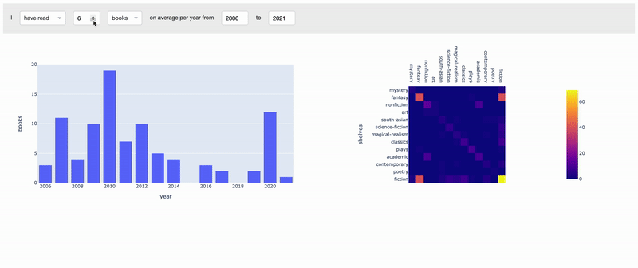

# GoodReads 

## About this app

Using my personal [Goodreads](https://www.goodreads.com/) data, I can visualize the number of books/pages I have read over time frame as well as the shelves related the books read during that time.

## Data

All data was acquired from [Goodreads](https://www.goodreads.com/).

I exported my personal data as a starting point, but you can do the same if you have a Goodreads account as follows:
* Go to [My Books](https://www.goodreads.com/review/list)
* Click on [Import and export](https://www.goodreads.com/review/import) under **Tools** on the left
* To **Export** your books to a .csv file, click on the **Export Library** button at the top of the screen, below the Export heading, then wait for the file to generate. This may take some time if you have a large library. If successful, you will see a **Your export from (date) - (time)** note below the button. Click on that text to download the .csv file.

Further data can be collected for each book by using its `book_id` noted in the .csv file (i.e. `"https://www.goodreads.com/book/show/" + book_id`) to access its webpage.

## Remarks

Given the 2-hour window to complete this challenge, I tried to keep it simple and polished. 

Unfortunately, the outcome is only a fraction of the ideas I had in mind! I wish I had more time to make the following tweaks at least:
* Include total books/pages given the inputs.
* Compare the heatmap and chord diagram representation of shelves. I was trying for the chord diagram at first (as I had once done for my sample app at the start of the Plotly internship using different data), but it appears some dependencies had been deprecated so I decided to move on for the sake of time. 
* To include both past and present in one go, I would also convert the year "start" and "end" input boxes to a range slider, and have two sentences somewhat like: (a) I have read [insert average] [dropdown: books, pages] on average per year from [insert min year on slider] to [insert current year]; (b) I plan to read [input box: projected average] [dropdown: books, pages] on average per year from [insert current year] to [insert max year on slider] 
* To include both past and present in one go, I would have to have two separate heatmaps/chord diagrams.
* Make the bar chart more entertaining. Currently the bar chart exclusively shows years BEFORE or AFTER the current year. If I allowed for the year range to be more flexible, such that the resulting bar graph incorporates both the present and the future, then it could include both past data and future projections... instead of the "unentertaining" future projections.
* Update the CSS to fit different media sizes (e.g. iPhone vs desktop).
* Change to dark theme. Maybe. 

Ultimately, there are even more data visualizations one can explore with the provided dataset combined with some (careful) web scraping, for example:
* Network graphs involving your followers and their followers (and onwards until a certain depth) and how that correlates with the type/rating of books read.

## How to run this app locally

Relocate to the respective app directory 

Install the requirements:

```
$ pip install -r requirements.txt
```

Run the app:

```
$ python app.py
```

View in your browser at http://127.0.0.1:8050.

## Screenshots



## Resources

* [Dash documentation for Python](https://dash.plotly.com/)
* [Plotly documentation for Python](https://plotly.com/python/)
* [Goodreads](https://www.goodreads.com/)